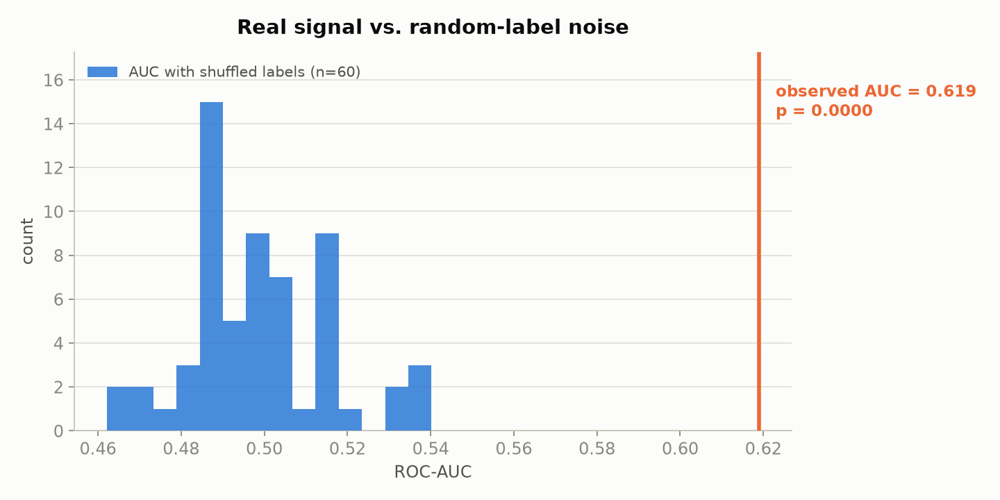
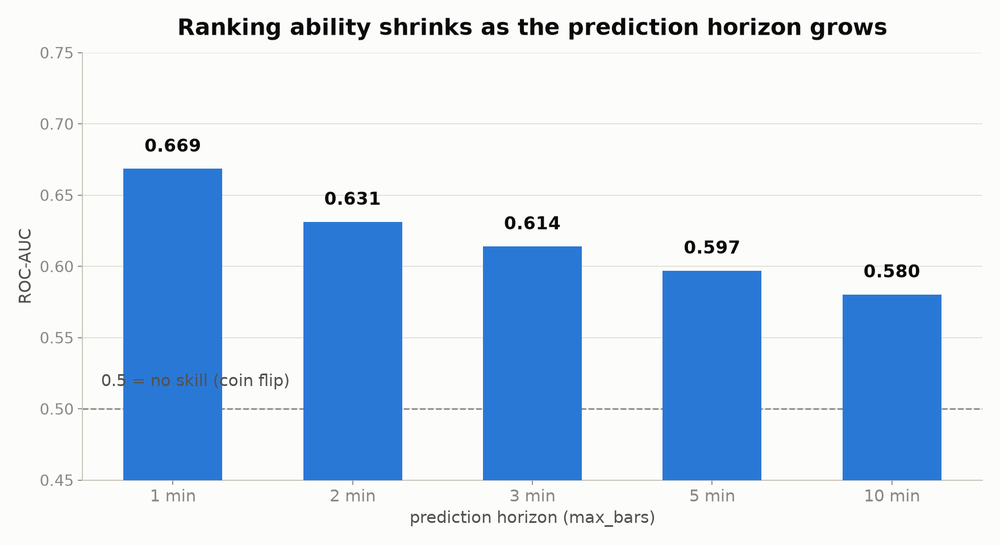
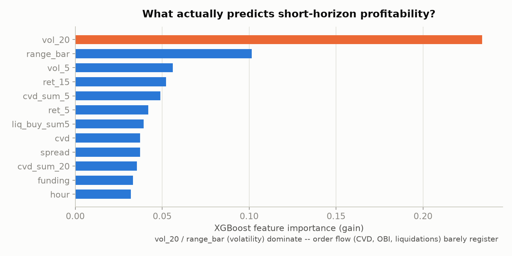
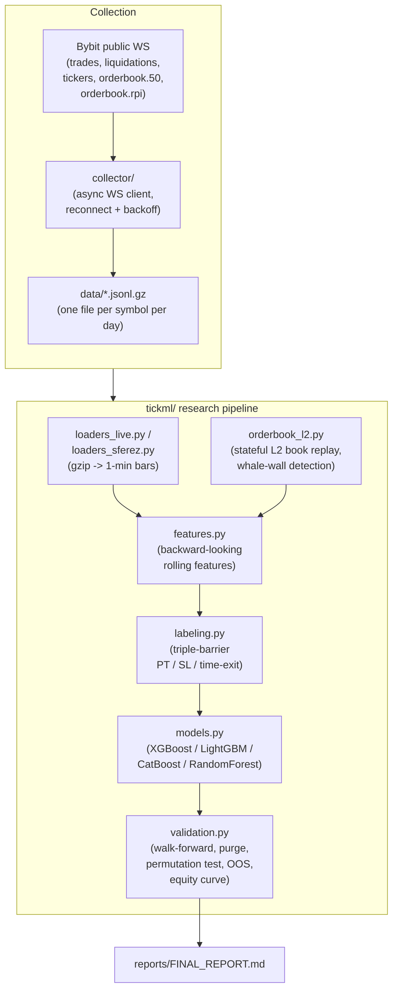
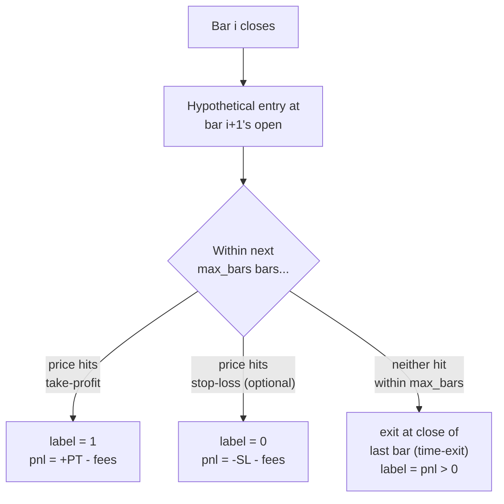
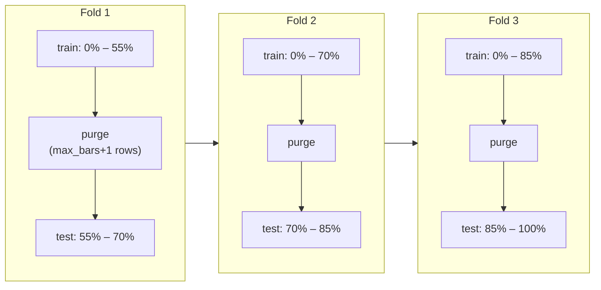

# tick-ml-research

*English · [Русский](README.ru.md) · [Slovenčina](README.sk.md)*

Research project: does a machine-learning classifier find a tradeable
short-horizon scalping edge in Bybit perpetual-futures **tick-level**
data (trades, order book, liquidations, funding, open interest) — as
opposed to slower candle/indicator-based strategies, which are out of
scope here?

**This repository is a research log, not a trading system.** It
documents a methodology and its results, including negative results.
Nothing in it is a recommendation to trade with real capital.

**What this demonstrates, if you're skimming for skills rather than
results:** an asynchronous WebSocket data collector (`asyncio`/
`websockets`, reconnect/backoff, daily-rotating compressed storage); a
data pipeline (Polars/Pandas/NumPy/Numba) processing tens of millions
of rows per symbol; rigorous ML validation (chronological walk-forward
with a purge gap, permutation testing, confirmation on an independent
year of out-of-sample data); statistical awareness of false positives
rather than reporting the first good-looking backtest; and a modular,
tested (`pytest`), dependency-locked (`uv`) codebase with data
collection kept separate from research code.

---

## Why this exists

I went looking for a short-horizon scalping edge in tick data because
I wanted to believe order flow and order-book depth held something a
slower, candle-based strategy couldn't see. They don't — not in this
data, not after roughly 80 honestly-tested hypotheses. I'd rather
publish that plainly than quietly bury the negative result and only
show the parts that look good.

What's in this repo is the actual trail: the off-by-one I found and
fixed in my own validation code, the configuration that looked
excellent on 17 trades and fell apart on 2,000 once tested properly,
the four model engines that all agreed with each other (which is its
own kind of answer). If you're reviewing this for a role, ask me about
any of it directly — I ran every experiment here, I understand why
each one failed or held up, and I'd rather defend a negative result
in detail than dress up a false positive.

---

## Headline result

A statistically real, cross-asset, cross-year predictive signal was
found — **ROC-AUC ≈ 0.58–0.67** depending on the prediction horizon
(AUC measures ranking ability: 0.5 = no better than a coin flip,
1.0 = perfect; this is a real but modest edge, not a strong one). It
is almost entirely explained by short-term realized-volatility
clustering, not order flow, order-book depth, or direction. No tested
configuration (~80 hypotheses: stop-loss variants, 4 model engines,
order-book depth, technical indicators, leverage, funding rate, open
interest, and several literal "smart money" concepts) produced a
**profit factor** reliably above 1.0 (profit factor = total winning
$ / total losing $; above 1.0 means net profitable after fees) on a
sample large enough to trust.
Full numbers: [`reports/FINAL_REPORT.md`](reports/FINAL_REPORT.md).

<p align="center">
  
</p>
<p align="center">
  
</p>
<p align="center">
  
</p>

---

## Data

| Source | Collected by | Symbols collected | Period | Included in repo? |
|---|---|---|---|---|
| Live tick data (trades, order book, liquidations, tickers/funding/OI) | This project's own WS collector (`collector/`) | 24 Bybit USDT perpetuals | 2026-04-22 → 2026-07-20 (90 days) | No — raw data is ~100 GB, gitignored |
| Historical tick data (out-of-sample check) | Third-party archive found online (not collected by this project) | BTC, ETH, SOL | 2024-02-12 → 2024-06-02 (112 days) | No — not redistributable |

The collector captures 24 symbols, but the actual experiments here
only use **BTCUSDT** (primary, ~80 hypotheses), plus **ETHUSDT** and
**SOLUSDT** for cross-asset checks against the same 90-day live
window. The historical archive covers BTC/ETH/SOL, but the
out-of-sample confirmation in this repo (`experiments/06`) only
trains/scores against its **BTC** data — see
[`reports/FINAL_REPORT.md`](reports/FINAL_REPORT.md#data-coverage-by-hypothesis)
for the exact symbol/period breakdown per hypothesis, including the
collector's own mid-dataset format change (2026-05-01/02).

**Why not all 24:** the independent 2024 archive — the strongest check
in this repo — only covers BTC/ETH/SOL, so extending the ~80-hypothesis
battery to the other 21 symbols would drop the one test that actually
distinguishes a real pattern from a false positive. ETH/SOL were picked
to check whether the BTC finding generalizes to other liquid, established
coins, not to scan the full symbol list for a separate edge; running the
same battery per-symbol also scales linearly in compute (the L2
order-book replay alone takes ~15 minutes per symbol). Scanning the
remaining altcoins — which are thinner and noisier, and would need
their own care around that — is a natural extension, not something
this repo claims to have ruled out.

Both datasets share the same bar-construction and feature pipeline
(`tickml/loaders_live.py`, `tickml/loaders_sferez.py`), which is what
makes the out-of-sample comparison in `experiments/06_sferez_oos_confirmation.py`
meaningful: same features, same labeling, same code path, a
different year than what any model in this repo was trained on.

To reproduce anything here you need your own copy of similarly-shaped
tick data. Set:

```bash
export TICKML_DATA_DIR=/path/to/your/collector/output
export TICKML_SFEREZ_DIR=/path/to/your/2024/historical/archive   # optional
```

---

## Architecture



---

## Methodology

### 1. Triple-barrier labeling

Every 1-minute bar is labeled independently of any trading rule: "if a
trade had entered at this bar's next open, would it have been
profitable?" This separates "can a model rank bars by future outcome"
from "does a hand-picked rule work" — the latter is what most public
scalping strategies actually test, and it conflates the two questions.



### 2. Walk-forward validation with a purge gap



The purge gap exists because a label at bar *i* depends on outcomes up
to `max_bars` bars in the future — without it, a training row near the
fold boundary could have a label that "sees into" the test window.

### 3. Independent-dataset out-of-sample check

The strongest test in this repo: train once on the full live (2026)
dataset, then score the 2024 historical dataset, which was never used
in training, feature selection, or threshold selection. A pattern that
only exists in the window it was mined on will not survive this;
`experiments/06_sferez_oos_confirmation.py` shows both a case where the
core AUC finding *does* survive, and a case where two "excellent" small
-sample results (n=17–26 trades) *do not* — the latter collapses back
toward/below breakeven once re-tested against thousands of independent
trades, the textbook signature of a multiple-comparisons false
positive rather than a real pattern.

---

## What was tested and rejected

Documented in full with numbers in
[`reports/FINAL_REPORT.md`](reports/FINAL_REPORT.md). Summary:

- Stop-loss variants (fixed and volatility-scaled) — no improvement,
  in several cases worse than no stop-loss at all.
- Trade direction (long vs. short) — statistically identical, evidence
  the signal is not directional.
- Order-book depth beyond top-of-book, replayed from raw L2 deltas,
  including an explicit "whale wall" (anomalously large single resting
  order) feature — no measurable effect, confirmed both on the full
  90-day window and on a restricted single-schema window (see below).
- 4 model engines (XGBoost, LightGBM, CatBoost, RandomForest) —
  interchangeable results.
- A full classical technical-indicator library (RSI, MACD, Bollinger,
  ADX, Stochastic, SuperTrend, Hurst exponent, CMF, Fisher transform,
  KAMA, MFI, linear-regression slope/R², z-score, efficiency ratio) —
  marginal improvement (+0.004 AUC), same underlying volatility story.
- Funding-rate extremes and open-interest/price quadrants as
  contrarian signals — not statistically significant (p = 0.20 and
  p = 0.61 respectively, permutation test — the convention used
  throughout this repo is p ≤ 0.05 to call a result significant, so
  neither clears that bar).
- A literal "liquidity sweep / stop hunt" rule (price wicks past a
  recent swing level with a coincident liquidation spike) — looked
  significant on 25 in-sample signals (p = 0.008) but failed a
  parameter-sensitivity check and could not be confirmed on the
  independent 2024 dataset (fired only 3–4 times there regardless of
  parameters).
- Leverage 1×–20×, simulated with a realistic MAE-based liquidation
  model rather than naive PnL multiplication — liquidation risk was
  ~0% at these leverages for the tested holding periods (1–5 minutes),
  meaning leverage simply scales whatever result already existed; it
  does not create an edge and amplifies the fragility of marginal
  (PF ≈ 1.0–1.1) configurations.

---

## One real trade-off, not staged

This project was built with an AI coding assistant. I'm not hiding
that — it doesn't matter much in 2026 whether code was AI-assisted;
what matters is whether the person behind it can explain and defend
every decision in it. Here's an actual exchange from that process,
kept because it's a better illustration of that than anything I could
write from scratch:

**Q: the L2 order-book replay takes ~15 minutes for 90 days of BTC —
is that a hardware limit or a software one?**

Mostly software. `orderbook_l2.py`'s day loader parses raw JSON
line-by-line into a plain Python dict-based order book — it can't be
vectorized the way the rest of the pipeline is (numba-JIT'd), because
each line depends on the accumulated state of the ones before it. The
actual fix is easy, and I know exactly what it is: the 90 days are
independent files with no shared state between them, so this is a
textbook `multiprocessing.Pool` case — parallelizing across days would
roughly halve the time on a 2-core machine, almost for free.

I didn't do it. Once the result came back clean — order-book depth
doesn't move the AUC (0.597 → 0.596 → 0.594, noise) — speeding up the
code that produced a null result stopped being worth the time. That's
a real trade-off ("works and is sufficient for the conclusion" vs.
"works fast"), not an unnoticed problem — and it's the kind of
judgment call that doesn't show up in a diff, only in being asked
about it directly.

---

## Repository layout

```
tickml/               core package: labeling, features, loaders, models, validation, L2 book replay
collector/             Bybit WS collector that produced the live dataset (see Data section)
experiments/           runnable scripts, each testing one group of hypotheses
tests/                 correctness tests (no-lookahead checks, labeling edge cases, validation math)
reports/FINAL_REPORT.md   full numeric writeup
```

## Running

```bash
uv sync
export TICKML_DATA_DIR=/path/to/your/tick/data
uv run pytest
uv run experiments/01_baseline_and_horizon.py
```

Each `experiments/*.py` file is independently runnable and prints its
own results; none require the others to have run first (aside from a
local parquet cache written to `.cache/` on first load of a given
symbol, to avoid re-parsing gigabytes of gzip on every run).
`experiments/08_make_figures.py` regenerates the 3 PNGs embedded above
into `figures/`.
