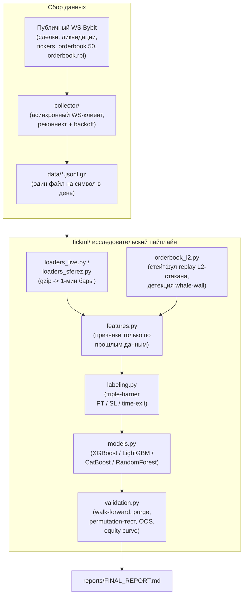
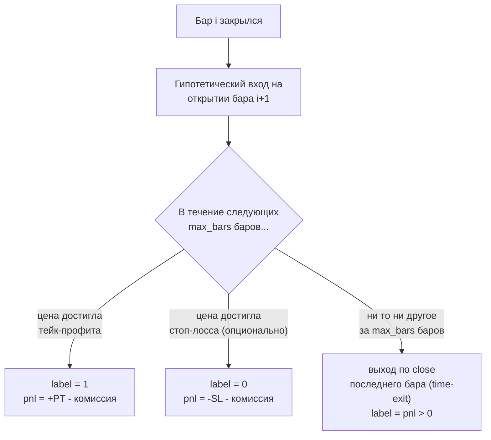
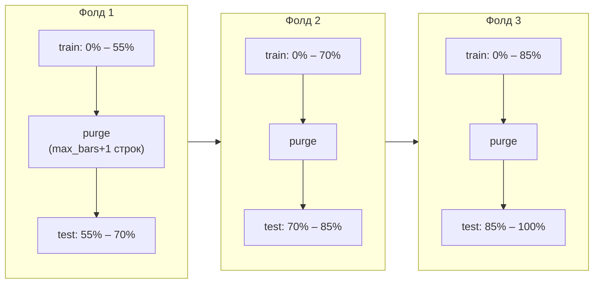

# tick-ml-research

*[English](README.md) · Русский · [Slovenčina](README.sk.md)*

Исследовательский проект: находит ли ML-классификатор торгуемое
преимущество на коротком горизонте в **тиковых** данных бессрочных
фьючерсов Bybit (сделки, стакан заявок, ликвидации, funding rate,
открытый интерес) — в отличие от более медленных свечных/индикаторных
стратегий, которые здесь не рассматриваются.

**Этот репозиторий — журнал исследования, а не торговая система.** Он
документирует методологию и её результаты, включая отрицательные.
Ничто здесь не является рекомендацией торговать реальным капиталом.

**Что это демонстрирует, если вы просматриваете репозиторий ради
навыков, а не результатов:** асинхронный WebSocket-коллектор данных
(`asyncio`/`websockets`, реконнект/backoff, посуточная ротация сжатого
хранилища); пайплайн обработки данных (Polars/Pandas/NumPy/Numba),
обрабатывающий десятки миллионов строк на символ; строгая ML-валидация
(хронологический walk-forward с purge-зазором, permutation-тестирование,
подтверждение на независимом годе данных вне выборки); статистическая
осознанность в отношении ложных срабатываний вместо публикации первого
красиво выглядящего бэктеста; и модульная, покрытая тестами (`pytest`),
с зафиксированными зависимостями (`uv`) кодовая база, где сбор данных
отделён от исследовательского кода.

---

## Зачем это существует

Я искал преимущество для скальпинга на коротком горизонте в тиковых
данных, потому что хотел верить, что order flow и глубина стакана
содержат то, что не видно более медленной, свечной стратегии. Не
содержат — по крайней мере не в этих данных, не после примерно 80
честно проверенных гипотез. Я предпочитаю опубликовать это прямо, а
не тихо похоронить отрицательный результат и показать только то, что
выглядит хорошо.

В этом репозитории — реальный путь: off-by-one баг, который я нашёл и
исправил в собственном коде валидации, конфигурация, которая
выглядела отлично на 17 сделках и развалилась на 2000, четыре модельных
движка, которые все согласились друг с другом (это тоже своего рода
ответ). Если вы рассматриваете это для найма — спрашивайте меня о
любой части напрямую: я прогнал каждый эксперимент здесь, понимаю,
почему каждый из них провалился или подтвердился, и предпочту
детально защитить отрицательный результат, чем приукрасить ложное
срабатывание.

---

## Главный результат

Найден статистически реальный, кросс-активный, кросс-годовой
предиктивный сигнал — **ROC-AUC ≈ 0.58–0.67** в зависимости от
горизонта предсказания (AUC измеряет способность к ранжированию:
0.5 = не лучше монетки, 1.0 = идеально; это реальное, но скромное
преимущество, не сильное). Оно почти полностью объясняется
краткосрочной кластеризацией волатильности, а не order flow, глубиной
стакана или направлением. Ни одна из протестированных конфигураций
(~80 гипотез: варианты стоп-лосса, 4 модельных движка, глубина стакана,
технические индикаторы, плечо, funding rate, открытый интерес и
несколько буквально закодированных "smart money" концепций) не дала
**profit factor** устойчиво выше 1.0 (profit factor = сумма прибыльных
$ / сумма убыточных $; выше 1.0 означает чистую прибыль после комиссий)
на выборке, достаточно большой, чтобы ей доверять.
Полные цифры: [`reports/FINAL_REPORT.md`](reports/FINAL_REPORT.md)
(на английском).

<p align="center">
  
</p>
<p align="center">
  
</p>
<p align="center">
  
</p>

---

## Данные

| Источник | Кто собрал | Собранные символы | Период | Есть в репозитории? |
|---|---|---|---|---|
| Живые тиковые данные (сделки, стакан, ликвидации, tickers/funding/OI) | Собственный WS-коллектор проекта (`collector/`) | 24 перпетуал-контракта Bybit (USDT) | 2026-04-22 → 2026-07-20 (90 дней) | Нет — сырые данные ~100 ГБ, в .gitignore |
| Исторические тиковые данные (проверка вне выборки) | Сторонний архив, найденный в сети (не собран этим проектом) | BTC, ETH, SOL | 2024-02-12 → 2024-06-02 (112 дней) | Нет — нельзя распространять |

Коллектор собирает 24 символа, но фактические эксперименты в этом
репозитории используют только **BTCUSDT** (основной, ~80 гипотез),
плюс **ETHUSDT** и **SOLUSDT** для кросс-активных проверок на том же
90-дневном живом окне. Исторический архив покрывает BTC/ETH/SOL, но
проверка вне выборки в этом репозитории (`experiments/06`) обучается и
проверяется только на его **BTC**-данных — точную раскладку
символ/период по каждой гипотезе см. в
[`reports/FINAL_REPORT.md`](reports/FINAL_REPORT.md#data-coverage-by-hypothesis)
(на английском), включая смену формата данных коллектора в середине
датасета (2026-05-01/02).

Оба датасета используют один и тот же пайплайн построения баров и
фичей (`tickml/loaders_live.py`, `tickml/loaders_sferez.py`) — именно
это делает осмысленным сравнение вне выборки в
`experiments/06_sferez_oos_confirmation.py`: те же фичи, та же
разметка, тот же код, но другой год, которого ни одна модель в этом
репозитории не видела при обучении.

Чтобы что-либо воспроизвести здесь, нужна собственная копия тиковых
данных аналогичной структуры. Задайте:

```bash
export TICKML_DATA_DIR=/path/to/your/collector/output
export TICKML_SFEREZ_DIR=/path/to/your/2024/historical/archive   # опционально
```

---

## Архитектура



---

## Методология

### 1. Разметка triple-barrier

Каждый 1-минутный бар размечается независимо от какого-либо торгового
правила: "если бы сделка вошла на открытии следующего бара, была бы
она прибыльной?" Это отделяет "может ли модель ранжировать бары по
будущему исходу" от "работает ли выбранное вручную правило" — второе
как раз и тестирует большинство публичных скальпинг-стратегий, смешивая
эти два разных вопроса.



### 2. Walk-forward валидация с purge-зазором



Purge-зазор нужен потому, что метка на баре *i* зависит от исходов
вплоть до `max_bars` баров в будущем — без него тренировочная строка
рядом с границей фолда могла бы иметь метку, которая "заглядывает" в
тестовое окно.

### 3. Проверка на независимом датасете вне выборки

Самая строгая проверка в этом репозитории: обучить модель один раз на
полном живом (2026 года) датасете, затем оценить её на историческом
датасете 2024 года, который никогда не участвовал в обучении, отборе
фичей или подборе порогов. Паттерн, существующий только в том окне, на
котором он был найден, такую проверку не переживёт;
`experiments/06_sferez_oos_confirmation.py` показывает и случай, где
основная AUC-находка *подтверждается*, и случай, где два "отличных"
результата на маленькой выборке (n=17–26 сделок) *не подтверждаются* —
второе откатывается обратно к безубытку или ниже при проверке на
тысячах независимых сделок — классический признак ложного
срабатывания из-за множественных сравнений, а не реального паттерна.

---

## Что было проверено и отвергнуто

Полностью задокументировано с цифрами в
[`reports/FINAL_REPORT.md`](reports/FINAL_REPORT.md) (на английском).
Кратко:

- Варианты стоп-лосса (фиксированные и масштабируемые по волатильности)
  — улучшения нет, в нескольких случаях хуже, чем вообще без стоп-лосса.
- Направление сделки (лонг vs шорт) — статистически идентичны,
  свидетельство того, что сигнал не направленный.
- Глубина стакана за пределами top-of-book, восстановленная из сырых
  L2-дельт, включая явную фичу "whale wall" (аномально крупная
  одиночная заявка) — измеримого эффекта нет, подтверждено и на полном
  90-дневном окне, и на ограниченном окне с единой схемой данных (см.
  ниже).
- 4 модельных движка (XGBoost, LightGBM, CatBoost, RandomForest) —
  результаты взаимозаменяемы.
- Полная классическая библиотека технических индикаторов (RSI, MACD,
  Bollinger, ADX, Stochastic, SuperTrend, экспонента Хёрста, CMF,
  Fisher transform, KAMA, MFI, наклон/R² линейной регрессии, z-score,
  efficiency ratio) — незначительное улучшение (+0.004 AUC), та же
  история про волатильность.
- Экстремумы funding rate и квадранты open-interest/цена как
  контрарианские сигналы — статистически не значимо (p = 0.20 и
  p = 0.61 соответственно, permutation-тест — принятая в этом
  репозитории конвенция: p ≤ 0.05 считается значимым, ни один результат
  этот порог не проходит).
- Буквальное правило "liquidity sweep / stop hunt" (цена пробивает
  недавний уровень свинга с одновременным всплеском ликвидаций) —
  выглядело значимым на 25 сигналах в выборке (p = 0.008), но не
  прошло проверку на чувствительность к параметрам и не подтвердилось
  на независимом датасете 2024 года (сработало там всего 3–4 раза
  независимо от параметров).
- Плечо 1×–20×, смоделированное с реалистичной моделью ликвидации на
  основе MAE, а не наивным умножением PnL — риск ликвидации был ~0% на
  этих плечах для протестированных периодов удержания (1–5 минут), то
  есть плечо просто масштабирует уже существующий результат; оно не
  создаёт преимущество и усиливает хрупкость маргинальных
  (PF ≈ 1.0–1.1) конфигураций.

---

## Структура репозитория

```
tickml/               основной пакет: разметка, фичи, загрузчики, модели, валидация, L2-стакан
collector/             WS-коллектор Bybit, собравший живой датасет (см. раздел "Данные")
experiments/           запускаемые скрипты, каждый проверяет одну группу гипотез
tests/                 тесты корректности (проверки на look-ahead, edge-кейсы разметки, математика валидации)
reports/FINAL_REPORT.md   полная числовая раскладка (на английском)
```

## Запуск

```bash
uv sync
export TICKML_DATA_DIR=/path/to/your/tick/data
uv run pytest
uv run experiments/01_baseline_and_horizon.py
```

Каждый файл `experiments/*.py` запускается независимо и печатает
собственные результаты; ни один не требует, чтобы остальные были
запущены раньше (кроме локального parquet-кэша в `.cache/`, который
пишется при первой загрузке символа, чтобы не парсить гигабайты gzip
заново при каждом запуске). `experiments/08_make_figures.py`
перегенерирует 3 PNG, встроенных выше, в `figures/`.
