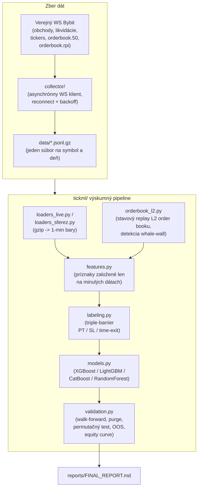
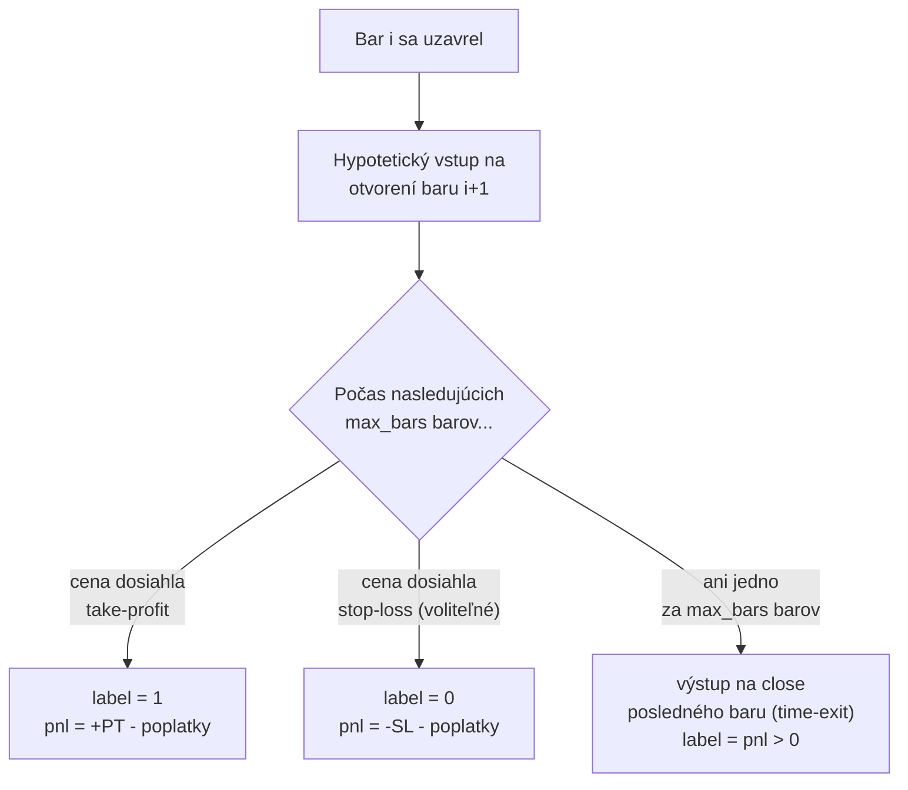
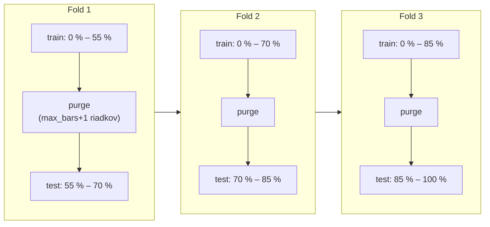

# tick-ml-research

*[English](README.md) · [Русский](README.ru.md) · Slovenčina*

Výskumný projekt: dokáže ML klasifikátor nájsť obchodovateľnú výhodu
na krátkom horizonte v **tikových** dátach z perpetuálnych futures na
Bybit (obchody, order book, likvidácie, funding rate, open interest) —
na rozdiel od pomalších sviečkových/indikátorových stratégií, ktoré tu
nie sú predmetom skúmania?

**Tento repozitár je výskumný denník, nie obchodný systém.**
Dokumentuje metodológiu a jej výsledky vrátane negatívnych. Nič v ňom
nie je odporúčaním obchodovať so skutočným kapitálom.

**Čo tento projekt demonštruje, ak repozitár prezeráte kvôli
zručnostiam a nie výsledkom:** asynchrónny WebSocket kolektor dát
(`asyncio`/`websockets`, reconnect/backoff, denne rotované komprimované
úložisko); dátový pipeline (Polars/Pandas/NumPy/Numba) spracúvajúci
desiatky miliónov riadkov na symbol; prísna ML validácia
(chronologický walk-forward s purge medzerou, permutačné testovanie,
potvrdenie na nezávislom roku dát mimo vzorky); štatistické povedomie
o falošne pozitívnych výsledkoch namiesto publikovania prvého pekne
vyzerajúceho backtestu; a modulárny, testovaný (`pytest`), so
zamknutými závislosťami (`uv`) kód, kde je zber dát oddelený od
výskumného kódu.

---

## Prečo tento projekt existuje

Hľadal som výhodu pre scalping na krátkom horizonte v tikových dátach,
pretože som chcel veriť, že order flow a hĺbka order booku obsahujú
niečo, čo pomalšia, sviečková stratégia nevidí. Neobsahujú — aspoň nie
v týchto dátach, nie po zhruba 80 čestne otestovaných hypotézach.
Radšej to zverejním priamo, než by som ticho pochoval negatívny
výsledok a ukázal len tie časti, ktoré vyzerajú dobre.

V tomto repozitári je skutočná stopa: chyba o jeden (off-by-one),
ktorú som našiel a opravil vo vlastnom validačnom kóde, konfigurácia,
ktorá vyzerala vynikajúco na 17 obchodoch a rozpadla sa na 2 000, štyri
modelové enginy, ktoré sa všetky navzájom zhodli (čo je tiež svojím
spôsobom odpoveď). Ak toto posudzujete pre pracovnú pozíciu, pýtajte sa
ma na čokoľvek priamo — spustil som každý experiment tu, rozumiem,
prečo každý z nich zlyhal alebo obstál, a radšej detailne obhájim
negatívny výsledok, než by som prikrášlil falošne pozitívny.

Pre presnosť, keďže je ľahké toto zaokrúhliť: táto konkrétna, prísna
práca s walk-forward validáciou má približne **7 mesiacov** (od
približne decembra 2025). Predtým, od mája 2025, boli neformálne
skúšobné behy na spotovom obchodovaní so základnými indikátormi cez
TA-Lib — experimentálne, nie na úrovni prísnosti ukázanej v tomto
repozitári. Radšej to poviem otvorene, než aby to znelo, že táto
úroveň prísnosti existovala celý rok, keď to tak nebolo.

Časť mojej skoršej práce na sviečkových (nie tikových) dátach tiež
priniesla backtesty, ktoré vyzerali pôsobivo — profit factor nad 2,
takmer žiadny drawdown — bez permutačného testu alebo skutočného
potvrdenia mimo vzorky za tým. Takémuto výsledku už sám o sebe
neverím — presne preto je tento repozitár postavený tak, ako je:
každé číslo tu musí prejsť rovnakými tromi kontrolami (či prežije
nulové rozdelenie na premiešaných štítkoch, či drží na dátach, ktoré
nikdy nevidel, či prežije mierne zmenené parametre) — až potom niečo
znamená.

---

## Hlavný výsledok

Bol nájdený štatisticky reálny prediktívny signál, konzistentný naprieč
aktívami (cross-asset) aj naprieč rokmi (cross-year) —
**ROC-AUC ≈ 0,58–0,67** v závislosti od horizontu predikcie (AUC meria
schopnosť radenia: 0,5 = nie lepšie ako hod mincou, 1,0 = dokonalé; ide
o reálnu, no skromnú výhodu, nie silnú). Je takmer úplne
vysvetlený krátkodobým zhlukovaním volatility, nie order flow, hĺbkou
order booku ani smerom. Žiadna z testovaných konfigurácií (~80
hypotéz: varianty stop-lossu, 4 modelové enginy, hĺbka order booku,
technické indikátory, páka, funding rate, open interest a niekoľko
doslovne zakódovaných konceptov "smart money") nedosiahla **profit
factor** spoľahlivo nad 1,0 (profit factor = súčet ziskových $ /
súčet stratových $; nad 1,0 znamená čistý zisk po poplatkoch) na
vzorke dostatočne veľkej na to, aby sa jej dalo veriť.
Kompletné čísla: [`reports/FINAL_REPORT.md`](reports/FINAL_REPORT.md)
(v angličtine).

<p align="center">
  
</p>
<p align="center">
  
</p>
<p align="center">
  
</p>

---

## Dáta

| Zdroj | Kto zbieral | Zbierané symboly | Obdobie | Súčasť repozitára? |
|---|---|---|---|---|
| Živé tikové dáta (obchody, order book, likvidácie, tickers/funding/OI) | Vlastný WS kolektor tohto projektu (`collector/`) | 24 perpetuálnych kontraktov Bybit (USDT) | 2026-04-22 → 2026-07-20 (90 dní) | Nie — surové dáta majú ~100 GB, sú v .gitignore |
| Historické tikové dáta (kontrola mimo vzorky) | Archív tretej strany nájdený online (nezbieral tento projekt) | BTC, ETH, SOL | 2024-02-12 → 2024-06-02 (112 dní) | Nie — nie je možné ho ďalej šíriť |

Kolektor zbiera 24 symbolov, ale skutočné experimenty v tomto
repozitári používajú iba **BTCUSDT** (hlavný, ~80 hypotéz), plus
**ETHUSDT** a **SOLUSDT** pre cross-asset kontroly na rovnakom
90-dňovom živom okne. Historický archív pokrýva BTC/ETH/SOL, ale
kontrola mimo vzorky v tomto repozitári (`experiments/06`) trénuje a
vyhodnocuje iba na jeho **BTC** dátach — presné rozdelenie
symbol/obdobie podľa hypotézy nájdete v
[`reports/FINAL_REPORT.md`](reports/FINAL_REPORT.md#data-coverage-by-hypothesis)
(v angličtine), vrátane zmeny formátu dát kolektora uprostred datasetu
(2026-05-01/02).

**Prečo nie všetkých 24:** nezávislý archív z roku 2024 — najprísnejšia
kontrola v tomto repozitári — pokrýva iba BTC/ETH/SOL, takže rozšírenie
batérie ~80 hypotéz na zvyšných 21 symbolov by pripravilo analýzu o
jediný test, ktorý naozaj odlíši reálny vzor od falošne pozitívneho
výsledku. ETH/SOL boli vybrané na overenie, či sa zistenie z BTC
prenáša na iné likvidné, etablované mince, nie na skenovanie celého
zoznamu symbolov kvôli samostatnej výhode; spustenie rovnakej batérie
pre každý symbol tiež lineárne rastie výpočtovo (samotný replay L2
order booku trvá ~15 minút na symbol). Preskenovanie zvyšných altcoinov
— ktoré sú tenšie a hlučnejšie a vyžadovali by vlastnú opatrnosť — je
prirodzeným rozšírením, nie niečím, čo tento repozitár tvrdí, že
vylúčil.

Oba datasety zdieľajú rovnaký pipeline na tvorbu barov a príznakov
(`tickml/loaders_live.py`, `tickml/loaders_sferez.py`) — práve to robí
zmysluplným porovnanie mimo vzorky v
`experiments/06_sferez_oos_confirmation.py`: rovnaké príznaky, rovnaké
označovanie, rovnaký kód, ale iný rok, ktorý žiadny model v tomto
repozitári nevidel pri trénovaní.

Na reprodukovanie čohokoľvek tu potrebujete vlastnú kópiu podobne
štruktúrovaných tikových dát. Nastavte:

```bash
export TICKML_DATA_DIR=/path/to/your/collector/output
export TICKML_SFEREZ_DIR=/path/to/your/2024/historical/archive   # voliteľné
```

---

## Architektúra



---

## Metodológia

### 1. Triple-barrier označovanie

Každý 1-minútový bar je označený nezávisle od akéhokoľvek obchodného
pravidla: "keby obchod vstúpil na otvorení nasledujúceho baru, bol by
ziskový?" Toto oddeľuje otázku "dokáže model zoradiť bary podľa
budúceho výsledku" od otázky "funguje ručne vybrané pravidlo" — druhé
je to, čo v skutočnosti testuje väčšina verejných scalping stratégií,
čím tieto dve otázky zamieňa.



### 2. Walk-forward validácia s purge medzerou



Purge medzera existuje preto, že štítok na bare *i* závisí od výsledkov
až do `max_bars` barov v budúcnosti — bez nej by tréningový riadok
blízko hranice foldu mohol mať štítok, ktorý "vidí" do testovacieho
okna.

### 3. Kontrola na nezávislom datasete mimo vzorky

Najsilnejší test v tomto repozitári: natrénovať model raz na celom
živom (2026) datasete, potom ho vyhodnotiť na historickom datasete z
roku 2024, ktorý nebol nikdy použitý pri trénovaní, výbere príznakov
ani výbere prahov. Vzor, ktorý existuje len v okne, na ktorom bol
nájdený, tento test neprežije;
`experiments/06_sferez_oos_confirmation.py` ukazuje jednak prípad, kde
hlavné AUC zistenie *obstojí*, aj prípad, kde dva "výborné" výsledky na
malej vzorke (n=17–26 obchodov) *neobstoja* — druhý sa vráti späť k
nule alebo pod ňu po opätovnom otestovaní na tisícoch nezávislých
obchodov, čo je učebnicový príznak falošne pozitívneho výsledku
spôsobeného mnohonásobným porovnávaním, nie reálneho vzoru.

---

## Čo bolo otestované a zamietnuté

Plne zdokumentované s číslami v
[`reports/FINAL_REPORT.md`](reports/FINAL_REPORT.md) (v angličtine).
Zhrnutie:

- Varianty stop-lossu (pevné aj škálované podľa volatility) — žiadne
  zlepšenie, v niekoľkých prípadoch horšie než bez stop-lossu vôbec.
- Smer obchodu (long vs. short) — štatisticky identické, dôkaz, že
  signál nie je smerový.
- Hĺbka order booku nad rámec top-of-book, rekonštruovaná zo surových
  L2 delt, vrátane explicitného príznaku "whale wall" (neprimerane
  veľká jednotlivá objednávka) — žiadny merateľný efekt, potvrdené
  na celom 90-dňovom okne aj na obmedzenom okne s jednotnou schémou
  (pozri nižšie).
- 4 modelové enginy (XGBoost, LightGBM, CatBoost, RandomForest) —
  zameniteľné výsledky.
- Kompletná klasická knižnica technických indikátorov (RSI, MACD,
  Bollinger, ADX, Stochastic, SuperTrend, Hurstov exponent, CMF,
  Fisherova transformácia, KAMA, MFI, sklon/R² lineárnej regresie,
  z-score, efficiency ratio) — okrajové zlepšenie (+0,004 AUC), rovnaký
  príbeh o volatilite.
- Extrémy funding rate a kvadranty open interest/cena ako
  kontrariánske signály — štatisticky nevýznamné (p = 0,20 a p = 0,61,
  permutačný test — konvencia použitá v celom tomto repozitári je
  p ≤ 0,05 pre označenie výsledku za významný, takže ani jeden túto
  hranicu neprekonáva).
- Doslovné pravidlo "liquidity sweep / stop hunt" (cena prerazí nedávnu
  swingovú úroveň so súbežným nárastom likvidácií) — na 25 signáloch vo
  vzorke pôsobilo významne (p = 0,008), ale neprešlo kontrolou citlivosti
  na parametre a nepotvrdilo sa na nezávislom datasete z roku 2024
  (spustilo sa tam len 3–4-krát bez ohľadu na parametre).
- Páka 1×–20×, simulovaná s realistickým modelom likvidácie založeným
  na MAE namiesto naivného násobenia PnL — riziko likvidácie bolo pri
  týchto pákach ~0 % pre testované doby držania (1–5 minút), čo
  znamená, že páka jednoducho škáluje už existujúci výsledok; nevytvára
  výhodu a zosilňuje krehkosť marginálnych (PF ≈ 1,0–1,1) konfigurácií.

---

## Jeden reálny trade-off (nie inscenovaný)

Tento projekt vznikol s pomocou AI asistenta pri programovaní.
Neskrývam to — v roku 2026 veľmi nezáleží na tom, či bol kód vytvorený
s pomocou AI; záleží na tom, či osoba za ním dokáže vysvetliť a obhájiť
každé rozhodnutie v ňom. Toto je skutočná výmena z toho procesu,
ponechaná tak, ako bola, pretože lepšie ilustruje podstatu než čokoľvek
napísané dodatočne:

**Otázka: replay L2 order booku trvá ~15 minút pre 90 dní BTC — je to
limit hardvéru, alebo softvéru?**

Väčšinou softvéru. Denný loader v `orderbook_l2.py` parsuje surový JSON
riadok po riadku do obyčajného Python `dict`-based order booku —
nedá sa vektorizovať tak ako zvyšok pipeline (numba-JIT), pretože každý
riadok závisí od nahromadeného stavu tých predchádzajúcich. Skutočná
oprava je jednoduchá a viem presne, aká: 90 dní sú nezávislé súbory bez
zdieľaného stavu medzi sebou, takže ide o učebnicový prípad pre
`multiprocessing.Pool` — paralelizácia naprieč dňami by čas na
2-jadrovom stroji približne prepolovila, takmer zadarmo.

Neurobil som to. Keď výsledok vyšiel čistý — hĺbka order booku nehýbe
s AUC (0,597 → 0,596 → 0,594, šum) — zrýchľovanie kódu, ktorý priniesol
nulový výsledok, prestalo stáť za ten čas. To je reálny trade-off
("funguje a stačí to na záver" vs. "funguje rýchlo"), nie nepovšimnutý
problém — presne tento typ rozhodnutia sa neukáže v diffe, len keď sa
naň niekto opýta priamo.

---

## Štruktúra repozitára

```
tickml/               hlavný balík: označovanie, príznaky, loadery, modely, validácia, replay L2 order booku
collector/             WS kolektor Bybit, ktorý zozbieral živý dataset (pozri sekciu Dáta)
experiments/           spustiteľné skripty, každý testuje jednu skupinu hypotéz
tests/                 testy správnosti (kontroly look-aheadu, hraničné prípady označovania, matematika validácie)
reports/FINAL_REPORT.md   kompletný číselný prehľad (v angličtine)
```

## Spustenie

```bash
uv sync
export TICKML_DATA_DIR=/path/to/your/tick/data
uv run pytest
uv run experiments/01_baseline_and_horizon.py
```

Každý súbor `experiments/*.py` je spustiteľný samostatne a vypisuje
vlastné výsledky; žiadny nevyžaduje, aby predtým bežali ostatné (okrem
lokálnej parquet cache v `.cache/`, ktorá sa zapíše pri prvom načítaní
symbolu, aby sa gigabajty gzipu neparsovali znova pri každom spustení).
`experiments/08_make_figures.py` znovu vygeneruje 3 PNG obrázky
vložené vyššie do `figures/`.
